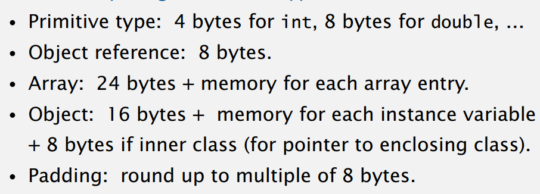

# 算法分析

## 概述

### 分析算法的原因

* 预测行动

* 比较算法

* 提供保证

* 理解理论基础

**最首要的实际原因是避免bug**

### 算法分析的科学方法

* **观察**自然特性

* 通过观察结果**假设**模型

* 使用假设**预测**事件

* 继续观察，尝试**验证**所作的预测

* **重复**实验以使假设和观察结果一致

**原则**：实验必须可复现；假设必须可证伪

### 经验分析

通过对算法给出**不同的输入**，获得不同情况下程序（算法）所用的**时间**

#### 结果可视化

通过**坐标轴的形式**表现出在不同输入下的输出，从而获得 函数关系

1. 标准图（n - Time）

2. log-log 图（lgN - lgT）

通过对图像进行**回归分析**得出假设

### 数学模型

#### 运行时的数学模型

总运行时间 = 所有的操作成本 * 频率 之和

* 需要分析具有**哪些操作**

* **成本**随硬件和软件（计算机，编译器）而改变

* **频率**取决于算法和输入数据

精确计算每个操作的频率**很繁琐**

##### 计算简化

1. cost model：使用一些**基本操作**作为总运行时的代表

2. 波浪符号
   
   **忽略**对结果影响较小的**低阶项**（取极限时相等）

**如何估计离散和？使用积分符号替换！**

##### 总结

理论上，我们可以获得精确的数学模型

但实际上

* 公式会很复杂

* 可能需要高级的数学计算

* 最好留给专家

所以我们**使用简化的估计模型**

### 增长顺序分类

#### 一般分类

常数，对数，线性，线性对数，二次，立方，指数等

### 算法理论

#### 分析类型

最好情况，最坏情况，平均情况（输入平均）

****

* 目的
  
  * 建立问题的**难度**
  
  * 获得**最佳**算法

* 方法
  
  * 分析中**忽略细节**
  
  * **关注最坏情况**以消除输入模型的可变性

* 最佳算法
  
  * 对于**任何输入**有性能保证
  
  * 没有更好的

#### 一般的表示形式

| $\Theta$ | $O$ | $\Omega$ |
| -------- | --- | -------- |
| 平均增长速度   | 上界  | 下界       |

#### 算法设计方法

1. 获得问题, 证明下界

2. 减低上界(获得新算法), 提高下界(更困难)

### 内存

对于一个java 对象, 内存 = 对象开销 16字节, 加上每个字段的空间+填充(对象所占内存为8字节的倍数)

#### 典型的内存使用(java)

